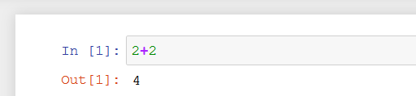

# Python Data Types
***
* Python numbers 
***
# Python Numbers
* integers: int (whole number 4)
* floating points: float (20.50)
* Multiply: *
* Divide: /
* Add: +
* Subtract: - 
* Modulo operator: % (returns the remainder after a division)
<br>
-ex use case: to check if a number is odd (you get a remainder of 1)... 23 % 2 = 1

* Powers: 2 ** 3 = 8
* Order of operations: (2+2) * (10*3)<br><br>


# Variable Assignments
* names cant start with a number and they cant have spaces
* names cant use special characters
* best practice is to have names in lowercase 
* Python uses Dynamic typing - you can reassign variables to different data types <br>
- you can do: <br>
 my_dogs = 2 ...then later reassign that to: <br> my_dogs = "Sammy"
* you can use type() to check the data type

# Strings
* Can use single or double quotes
* You can wrap one kind of quotes within the other: <br>
```" I don't like that"```
* You can index and slice strings
### Indexing
* Used when you want a single character in a string
* each character has an index starting at 0 
* you can do reverse indexing as well (ex use -1 to grab the last character)
### Slicing
* Slicing allows you to grab a section of a string
* [start:stop:step]
### Escape sequences
* ex: you can use \n for new line
* ``` print('hello \nworld')```
* ```\t``` for tab
* len function ```len("hello")``` = ```5``` (white space counts)

# Indexing and Slicing Strings
### Indexing:
* ```mystring = "Hello World"```
* indexing: ```mystring[8]``` returns ```r```
* reverse indexing: ```mystring[-2]``` returns ```l```
### Slicing
* ```mystring = "abcdefghijk"```
* ```mystring[2:]``` returns ```c``` to the end
* return up to a certian spot: ```mystring[:3]```
* grabbing a sub section: ```mystring[3:6]```
* step size - read in steps: ```mystring[::2]``` .. reads every other character
* reverse a string: ```mystring[::-1]```

# String Properties and Methods
* immutability:
* ```name = 'Sam'```
* You cannot change a string because it is immutable: ```name[0] = P```
* You can update a variable though (string concatination): <br>
```newname = 'P' + name[1:3]```
* you can multiply strings <br>
```letter = z``` <br>
```z * 3 = zzz```
* adding strings does concatonation not actual addition due to dynamic typing = ex: ```"2" + "3" = "23"```
### Methods
* ```x = "Hello World"```
* you can use methods to manipulate the string 
* ex: ```x.upper() = HELLO WORLD```
* ex: ```x.split() = HELLO WORLD``` ... breaks it into a list: ```['Hello', 'World']``` 
* you could also split on a specific letter ```x.split(i)```

# Print Formating with Strings
* Concatination: ```print("Hello " + my_name)```
### Interpolation:
#### .format() :
* ```"string".format('something1', 'something2')```
* ```print('text stuff '.format(more text))``` returns ``` text stuff more text```
* Insert by index position:
* ```print('the {} {} {}.format('fox','brown','quick'))``` returns ```the fox brown quick```
* you can order it as such: ```print('the {2} {1} {0}.format('fox','brown','quick'))``` returns ```the quick brown fox```
*you can use variables: ```print('the {q} {b} {f}.format(f = 'fox',b = 'brown',q = 'quick'))``` returns ```the quick brown fox```
#### float formatting
* you can do: ```"{value:width.precision f}"```
* normal: 100/777
* ```print("the result was: {r:1.3f}".format(r = result))``` would return 0.129 for example
* width is essentially white space - so adding a width of 6 to a 4 character float just makes the string longer
#### f strings
* ```name = donovan```
* ```print(f"his name is {name}")```
* New from python 3.6

# Lists
* ordered sequences that can hold a variety of object types
* ```mylist = [1,2,"string",4.55]```
* lists support indexing and slicing - they also support methods
* ```len(mylist)```
* ``` mylist[3] ``` is 4.55
* lists can be changed ... ```mylist[3] = "four"```
* ```mylist.append("item 5")```
* to remove an item from a list (the last item in the list): ```mylist.pop()``` or ```removed_item = mylist.pop()``` or to remove a specific item ```mylist.pop(0)``` ... pop returns the item removed
* to sort the list: ```mylist.sort()``` (doesnt return anything it just updates the actual list)
* to sort in revers: ```mylist.reverse()```

# Dictionaries
* unordered mappings for storing objects
* uses key value pairing
* you can call the key to get the value
* cannot be sorted
* ```mydict = {"key1":"value1","key2":2} ```
* ```mydict['key1']``` returns ```value1```
* dictonaries can hold lists
* ```fancydict = {"key1":["a","b","c"]}```
* ```fancydict["key1"][2].upper()``` would return ```C```
* to add or overwrite: ```mydict["newkey"] = "new value"```
#### useful methods
* mydict.keys() ... shows all the keys
* mydict.values() ..shows all the values