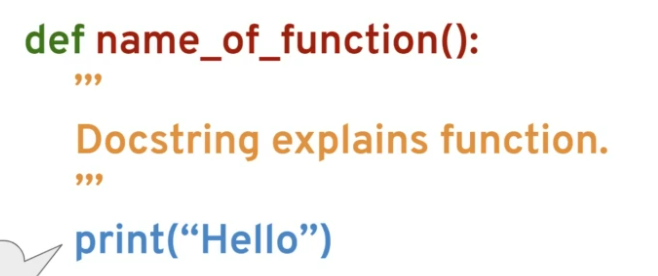

# Methods and Functions
***

# Methods
* built in objects in Python 
* there are many built in methods in python like .append() or .split() or .pop()
* in jupyter notebook shift+tab will show you info on the method
* the help function will give info on a method:
```
help(mylist.append)
```
* Offical Python Library Documentation: https://docs.python.org/3/library/index.html

# Intro to Functions
* you should create clean repeatable code
* functions allow you to create reusable blocks of code

# Def
* Syntax:

* Name: you should use all lowercase in the function name along with underscores (snake casing)
* Docstring: multiline comment where you can describe the function
* Code: code 
* To call the function: ```name_of_function()```
* functions can take paramaters:
```
def say_hello(name):
    message = (f'hello {name}')
    return message

say_hello("Donovan") 

# returns the name Donovan due to the return item
```

# Basics of Python Functions
* You can give a default value for a paramater like this:
```
def myfunc(myparam='default value'):
     # code
     return num1+num2

result = myfunc('param value')
```
* if you want to save the output of a function use ```return```
* you should have input validation to ensure your data is what it should be. You dont want a number being presented as a string for example

# Logic with Python Functions
* check for even number
```
def check_even(number):
    return number % 2 == 0

check_even(20) # would return True
```
* return true if any number is even inside a list
```
def check_even_list(num_list):
     for number in num_list:
         if number % 2 == 0:
            return True
         else:
            pass
      return False # this is if it passes on all odd numbers 

check_even_list([2,4,5]) # Would return True
```
* once you return the function is over
* if you wanted to return all the even numbers you could add the numbers to a new list and then return that list

# Tuple Unpacking with Python Functions
```
stock_prices = [('APPL',200),('GOOG',400),('MSFT',100)]

for item in stock_prices:
    print(item)

# example of tuple unpacking
for ticker,price in stock_prices:
    print(ticker)
```
* you can use tuple unpacking within a function - you can return a tuple 
```
# if you return "return (employee_of_month,hours)
# you can get the value as 2 different variables

name,hours = employee_check_func(work_hours)
# refrencing name gives 1 value
# refrencing hours gives a seperate value

```
# Interactions Between Functions
* you can take 1 function and use it as input for another function
```
example -  [' ','O',' ']

from random import shuffle

def shuffle_list(mylist):
     shuffle(mylist)
     return mylist

def player_guess():
    guess = ''
    while guess not in ['0','1','2']
       guess = input("pick a number: 0,1 or 2 ")
    return int(guess)

def check_guess(mylist,guess):
    if mylist[guess] == 'O':
        print('u win')
    else:
        print('wrong')
        print(mylist)

mixedup_list = shuffle_list(example)
guess = player_guess()
check_guess(mixedup_list,guess) 
# notice how it takes the return values from the other functions
```

# "\*args" and "**kwargs" in Python
## "\*args"
* Normal function example:
```
def myfunc(a,b):
     returns sum((a,b)) * 0.05
```
* "\*args" allows you to take an arbitrary ammount or arguments - see example:
```
def myfunc(*args):
    return sum(args) * 0.05

myfunc(40,50,400,30,40)
```
* Both functions do the same thing but notice how the one with "\*args" is much more flexible
* "\*args" stores those values as a tuple
* the word args in "\*args" can be anything - so you could use "\*myfunparams" - the ```*``` is what matters 

## "**kwargs"
* this returns a dictionary - unlike "\*args" which returns a tuple
```
def myfunc(**kwargs):
    if 'fruit' in kwargs:
        print('my fruit of choice is {}'.format(kwargs['fruit']))
    else: 
        print('I did not find any fruit here')

myfunc(fruit='apply', veggie = 'lettuce') # only returns the apply one

```
## both
* example:
```
def myfunc(*args,**kwargs):
    print(args)
    print(kwargs)
    print('I would like {} {}'.format(args[0],kwargs['food]))

myfunc(10,200,20,fruit='oarnge',animal='dog')
```
* when you run the function you have to put the args first since you specified them first - its a positional argument

# Lambda Expressions, Map, and Filter Functions
## Map
* Lambda expressions are a way to make anonymous functions (one time use functions that arent even named - use em one time and forget em)
* you can use map to essetially map a function to each iterabls
* Map takes all objects in a list and allows you to apply a function to it
```
map(func,iterables*)
```
```
# function for use

def square(num):
     return num**2

my_nums = [1,2,3,4,5]

for item in map(square,my_nums)
     print(item)
    # this basically runs the square function on every item in the list

```
* an example with strings
```
def splicer(mystring):
     if len(mystring)%2 == 0:
          return 'EVEN'
     else:
          return mystring[0]

names = ['andy', 'eve', 'sandy']

list(map(splicer,names))
```
* notice how when you call the function in map you dont include `()`
## Filter 
* you need to filter by a function that returns true or false
* Filter takes all objects in a list and runs that through a function to create a new list with all objects that return True in that function.
```
def check_even(num):
     return num%2 == 0
    
mynums = [1,2,3,4,5,6]

for n in filter(check_even,mynums):
    print n
```

## Lambda Expressions
* a normal function
```
def square(num):
     result = num ** 2
     return result

square(3)
```
* lambda expression
```
square = lambda num: num ** 2
square(5)

# its assumed this is one time use
```
* lambda is often used with map or filter - notice how its less code than defining the whole function
```
list(map(lambda num: num ** 2,mynums))
```
```
list(filter(lambda num:num%2 == 0,mynums))
```
```
list(map(lambda name:name[0],names))
# gets the first letter of the names in the list mylist
```
* you should only use lambda expressions when you can easily read it when coming back to your code

# Nested Statements and Scope